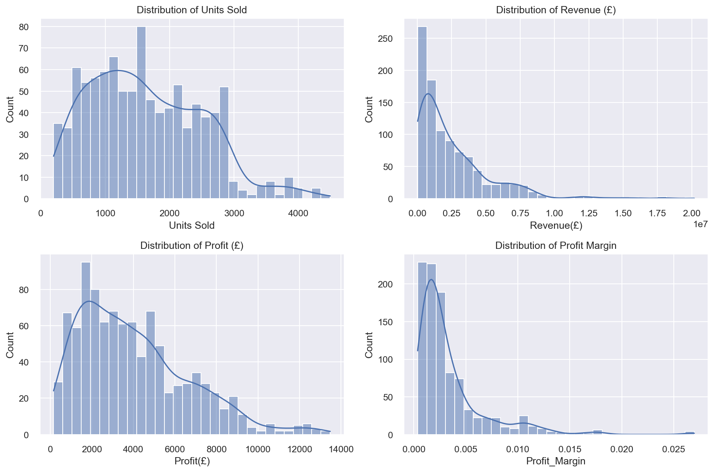
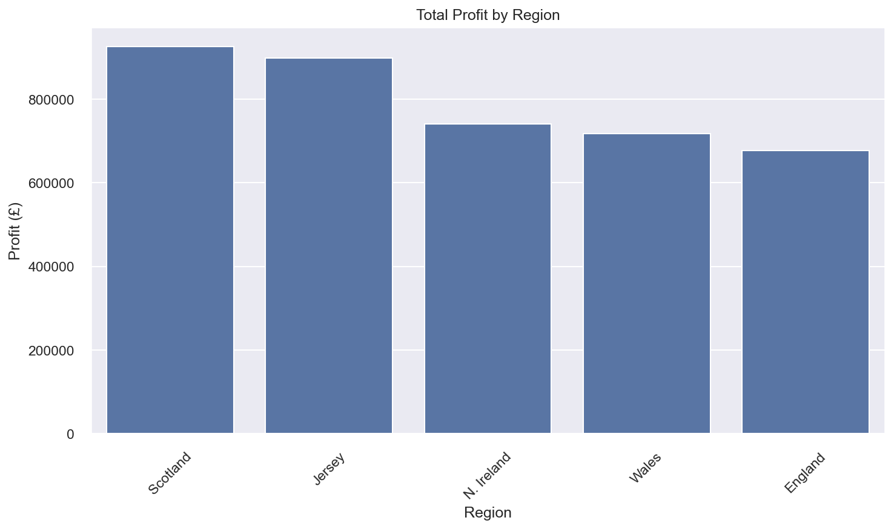
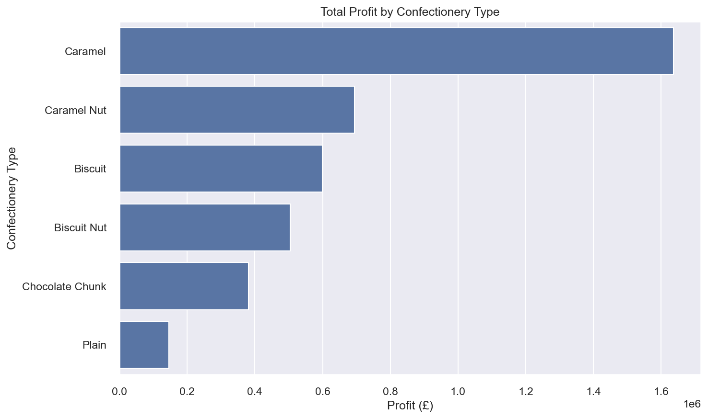

# Arden Confectionary Sales Data Visualization

## Course Information
**Course:** COM7021 – Data Visualisation  
**Institution:** Arden University  
**Student:** Muhammad Umar Uz Zaman  
**Student ID:** STU1197819  

## Project Overview

This project analyzes UK confectionary sales data to understand regional performance, product profitability, and temporal trends. The analysis aims to provide actionable insights for business decision-makers in the British Confectionary Council.

### Key Research Questions
1. **Regional Performance:** How do sales and profitability differ between UK regions?
2. **Product Analysis:** Which confectionery products have the highest and lowest profit margins?
3. **Temporal Trends:** How do regional sales change over time, and which regions show peak performance?

## Dataset

**Source:** `confectionary.xlsx`  
**Records:** 1,001 sales transactions  
**Time Period:** 2000-2005  
**Regions:** England, Jersey, Northern Ireland, Scotland, Wales  

### Data Structure
- **Date:** Transaction date
- **Country(UK):** UK region
- **Confectionary:** Product type (Chocolate Chunk, Caramel Nut, Biscuit, etc.)
- **Units Sold:** Quantity sold
- **Cost(£):** Cost price
- **Profit(£):** Profit amount
- **Revenue(£):** Revenue amount

## Analysis Components

### 1. Exploratory Data Analysis (EDA)
- **Data Cleaning:** Handling missing values, standardizing product names
- **Descriptive Statistics:** Distribution analysis of key metrics
- **Visual Exploration:** Histograms, box plots, and correlation analysis

### 2. Regional Analysis
- **Performance Metrics:** Total revenue, profit, and units sold by region
- **Profit Margins:** Average profit margins across regions
- **Comparative Visualizations:** Bar charts and ranking analysis

### 3. Product Analysis
- **Profitability Assessment:** Profit margins by confectionery type
- **Volume vs. Profit:** Scatter plots and ranking charts
- **Regional Product Performance:** Cross-tabulation analysis

### 4. Temporal Analysis
- **Time Series Trends:** Monthly sales patterns by region
- **Seasonality Detection:** Peak sales periods identification
- **Year-over-Year Growth:** Annual performance comparison

### 5. Interactive Dashboard (Planned)
- **Streamlit Application:** Real-time data exploration
- **Dynamic Filters:** Region, product, and date range selection
- **KPI Cards:** Key performance indicators display
- **Interactive Charts:** Region-level, product-level, and time series visualizations

## Project Structure

```
├── main.ipynb                 # Main analysis notebook with comprehensive EDA
├── Analysis.ipynb            # Additional analysis notebook
├── confectionary.xlsx        # Raw sales data
├── technical_plan.md         # Detailed implementation guidance
├── grading criteria.xlsx     # Assessment criteria
├── Task.pdf                  # Project requirements
├── outputs/                  # Aggregated data exports
│   ├── region_summary.csv       # Regional performance summary
│   ├── region_conf_summary.csv  # Region × Product analysis
│   ├── month_region.csv         # Monthly regional sales
│   └── year_region.csv          # Annual regional sales
├── generate_visualizations.py # Script to create visualization images
├── images/                   # Generated visualization images
│   ├── key_distributions.png
│   ├── regional_profit.png
│   └── product_profit.png
├── src/                      # Source code modules
│   └── data_prep.py          # Data preparation functions
├── dashboard/                # Interactive dashboard
│   ├── app.py                # Streamlit application
│   └── capture_dashboard_screenshots.py # Screenshot capture tool
└── README.md                 # This file
```

## Key Findings

### Regional Performance (2000-2005)
- **Scotland:** Highest total revenue (£633.4M) and profit (£926.3K)
- **Jersey:** Strong profit margins (0.32%) and consistent performance
- **Northern Ireland:** Best average profit margin (0.38%)
- **Wales:** Competitive performance across multiple metrics

### Product Performance
- **Chocolate Chunk:** Most popular product by volume
- **Caramel Nut:** Strong profit performance
- **Regional Variations:** Different products excel in different regions

### Temporal Patterns
- **Peak Seasons:** Varying peak periods across regions
- **Growth Trends:** Overall positive sales trajectory
- **Seasonal Variations:** Clear monthly patterns in sales volume

## Visualizations & Results

### Data Distributions

*Figure 1: Distribution of key metrics showing right-skewed patterns in revenue and profit, indicating a few large transactions drive most of the business value.*

### Regional Performance

*Figure 2: Total profit by UK region (2000-2005), with Scotland leading in absolute profit while Northern Ireland shows strongest profit margins.*

### Product Performance

*Figure 3: Profit by confectionery type, highlighting Chocolate Chunk as the volume leader and Caramel Nut as a premium margin product.*

### Dashboard Preview
The interactive Streamlit dashboard includes:
- **KPI Cards:** Total units, revenue, profit, and average margin (dynamically updating)
- **Regional Analysis:** Interactive bar charts showing profit by region
- **Product Insights:** Performance comparison across confectionery types
- **Time Series:** Monthly trends with region filtering and interactive legends
- **Cross-Analysis:** Heatmap showing profit margins by region and product type

**🎯 Key Dashboard Benefits:**
- **Real-time Filtering:** Instantly see how different combinations affect business metrics
- **Interactive Exploration:** Hover over charts for detailed information
- **Business Intelligence:** Support data-driven decision making for the British Confectionary Council
- **Mobile Friendly:** Responsive design that works on all devices

### Key Statistics Summary

| Metric | Mean | Median | Std Dev | Min | Max |
|--------|------|--------|---------|-----|-----|
| Units Sold | 1,452 | 1,374 | 937 | 1 | 4,452 |
| Revenue (£) | 2.1M | 1.8M | 1.8M | -1.4M | 19.7M |
| Profit (£) | 3,200 | 2,700 | 3,400 | -8,000 | 31,000 |
| Profit Margin | 0.31% | 0.29% | 0.15% | -0.76% | 1.2% |

*Data based on 984 cleaned transactions after removing missing values*

## Technical Implementation

### Libraries Used
```python
pandas >= 1.5.0        # Data manipulation
numpy >= 1.21.0        # Numerical operations
matplotlib >= 3.5.0    # Static visualizations
seaborn >= 0.11.0      # Statistical visualizations
plotly >= 5.0.0        # Interactive charts
streamlit >= 1.0.0     # Dashboard framework (planned)
```

### Visualization Generation
To create the visualization images shown in this README:
```bash
python generate_visualizations.py
```
This script will generate PNG files in the `images/` directory that can be included in reports or presentations.

### Environment Setup
```bash
# Create virtual environment
python -m venv venv
source venv/bin/activate  # On Windows: venv\Scripts\activate

# Install dependencies
pip install pandas numpy matplotlib seaborn plotly streamlit

# Launch Jupyter
jupyter notebook main.ipynb
```

### Data Processing Pipeline
1. **Data Loading:** Excel file import with pandas
2. **Cleaning:** Missing value handling and data type conversion
3. **Feature Engineering:** Time components and financial ratios
4. **Aggregation:** Regional and product-level summaries
5. **Visualization:** Static and interactive chart creation

## Running the Analysis

### Prerequisites
- Python 3.8+
- Jupyter Notebook or JupyterLab
- Required Python packages (see above)

### Execution Steps
1. **Clone/Download** the project repository
2. **Install Dependencies:** `pip install pandas numpy matplotlib seaborn`
3. **Launch Main Analysis:** `jupyter notebook main.ipynb`
4. **Run All Cells:** Execute the notebook from top to bottom
5. **Generate Visualizations (Optional):** `python generate_visualizations.py`
6. **Review Outputs:** Check generated visualizations and CSV exports

### Interactive Dashboard
The project includes a fully functional Streamlit dashboard for interactive data exploration:

```bash
# Navigate to dashboard directory
cd dashboard/

# Activate virtual environment (if using venv)
source ../.venv/Scripts/activate  # On Windows
# or
# source ../venv/bin/activate     # On macOS/Linux

# Run the dashboard
streamlit run app.py
```

**Dashboard Features:**
- **Interactive Filters:** Filter by region, product type, and date range
- **KPI Cards:** Real-time metrics that update with filters
- **Regional Analysis:** Profit performance across UK regions
- **Product Insights:** Confectionery type profitability comparison
- **Performance Matrix:** Heatmap showing profit margins by region and product
- **Time Series:** Monthly sales trends with regional breakdown

**Dashboard URL:** Once running, access at `http://localhost:8501`

## Visualizations Generated

### Static Charts (Matplotlib/Seaborn)
- Distribution histograms (revenue, profit, units sold)
- Regional performance bar charts
- Product profitability comparisons
- Time series line plots
- Profit margin heatmaps

### Interactive Charts (Plotly - Planned)
- Dynamic regional dashboards
- Filterable product comparisons
- Time series with drill-down capabilities
- Cross-regional performance matrices

## Assessment Alignment

### Task 1: Data Visualization & Analysis
- ✅ Comprehensive EDA with statistical summaries
- ✅ Multiple visualization types (static + planned interactive)
- ✅ Clear labeling and professional presentation
- ✅ Justification of design choices for business audience

### Task 2: Written Report
- 📝 Structured analysis with numbered headings
- 📝 Business-focused insights and recommendations
- 📝 Technical decisions documented and justified
- 📝 Integration of visualizations with explanatory text

## Future Enhancements

### Dashboard Features
- Real-time KPI monitoring
- Geographic visualizations (UK regional map)
- Predictive analytics integration
- Export functionality for reports

### Advanced Analytics
- Customer segmentation analysis
- Price elasticity modeling
- Market basket analysis
- Forecasting models

## Contact Information

**Student:** Muhammad Umar Uz Zaman  
**Student ID:** STU1197819  
**Course:** COM7021 – Data Visualisation  
**Institution:** Arden University  

## Acknowledgments

- Arden University for course materials and assessment framework
- British Confectionary Council for providing the dataset
- Open-source Python community for data science tools

---

*This project demonstrates comprehensive data visualization skills for business intelligence applications, focusing on actionable insights for non-technical decision-makers.*
